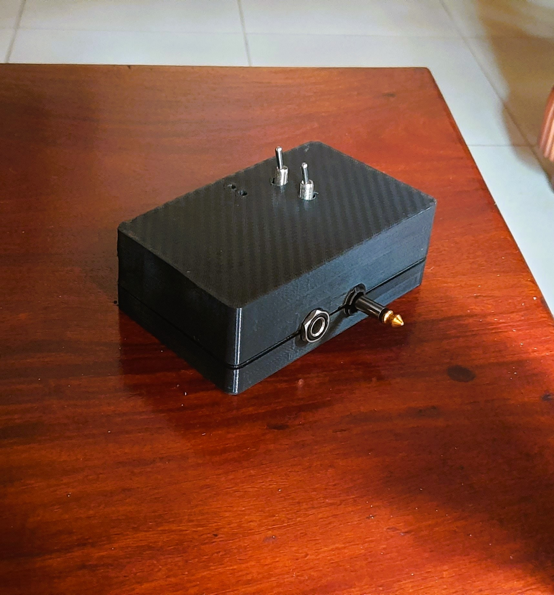
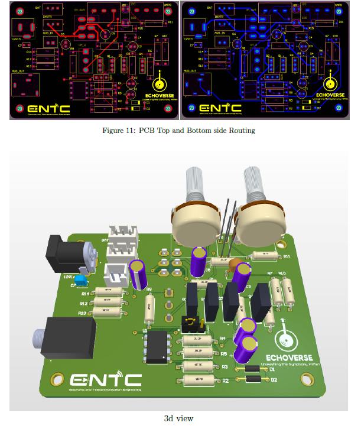
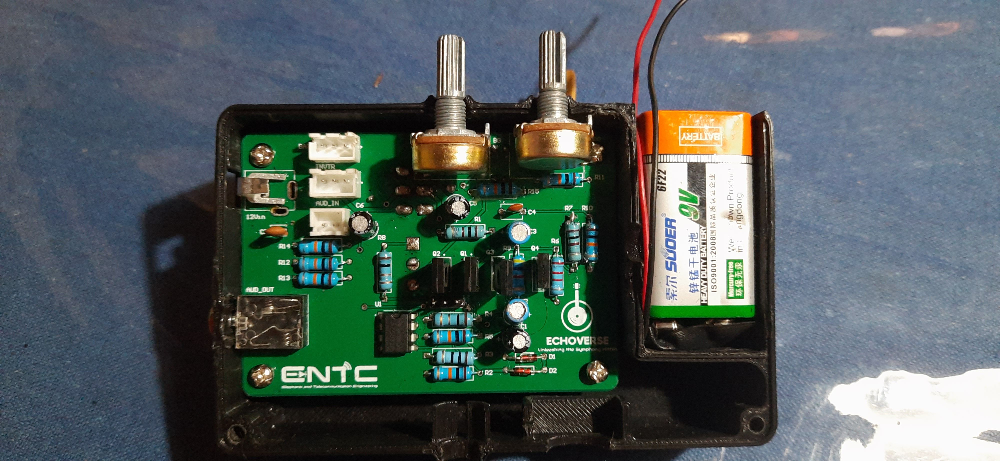
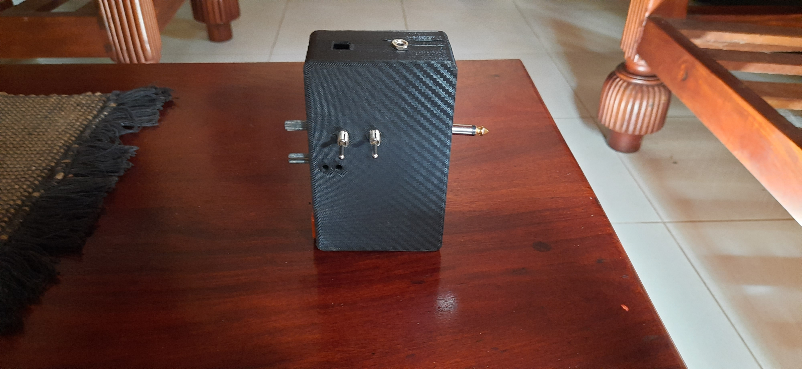
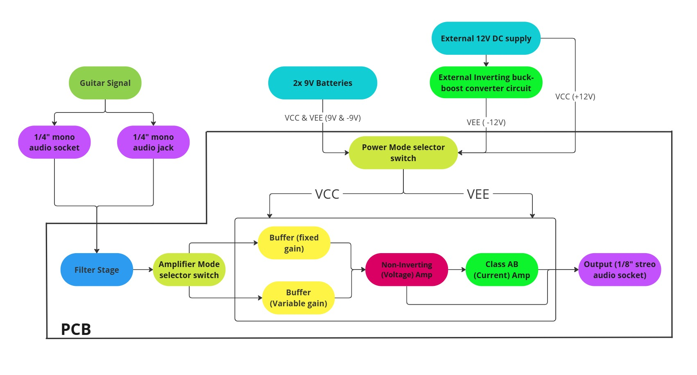
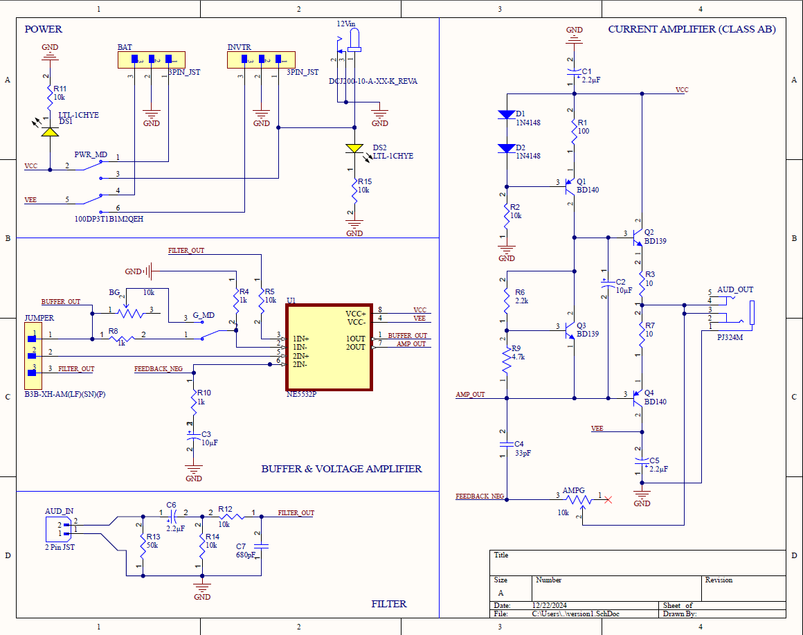
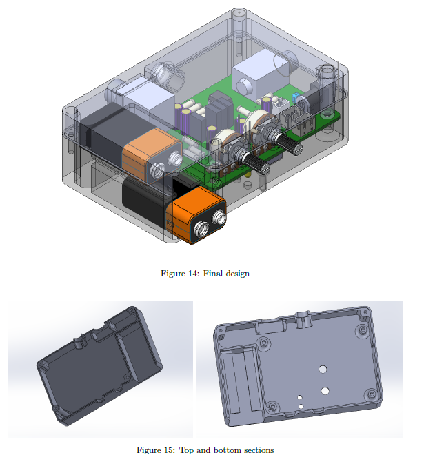

# 🎸 Guitar Headphone Amplifier – *Echoverse*  
*Personal monitoring for guitarists, anywhere.*

> **Module:** EN 2091 Laboratory Practice and Projects  
> **University:** Dept. of Electronic & Telecommunication Engineering, University of Moratuwa  
> **Authors:** Kiran Gunathilaka · Nuwan Dhananjaya Hapuarachchi · Achintha Rukshan Hathurusinghe · W.M.R. De Alwis  

---

## Table of Contents
1. [Project Overview](#project-overview)  
2. [Features](#features)  
3. [System Architecture](#system-architecture)  
4. [Hardware Highlights](#hardware-highlights)  
5. [Credits](#credits)  
6. [License](#license)  

---

## Project Overview
**Echoverse** is a pocket-sized guitar headphone amplifier that doubles as a 10 W practice speaker amp.  
It runs either on dual 9 V batteries or a 12 V DC adapter and offers two independent gain ranges optimised for **headphones** and **small speakers**.

---

## Features
| Mode | Voltage Gain | Intended Load | Notes |
|------|--------------|---------------|-------|
| Headphone | 2 × – 22 × | 8 Ω headphones | Safety-limited to protect drivers |
| Speaker   | 1 × – 121 × | 4 Ω / 8 Ω speakers | Push-pull class-AB stage |

* Dual-supply operation (±9 V batteries **or** +12 V adapter with inverting converter)  
* Low-noise **NE5532** front-end with two-stage class-AB power driver  
* SolidWorks-designed aluminium enclosure with intuitive front-panel controls  
* Fully validated in **Cadence PSpice** (transient, noise, THD) and hardware-bench tests  

---

## System Architecture

1. **Pre-Amp Buffer** – fixed gain (headphone mode) / variable gain (speaker mode)  
2. **Variable Gain Stage** – non-inverting op-amp  
3. **Class-AB Output** – complementary BD139/BD140 pair  
4. **Power Management** – battery selector & inverting buck-boost converter  

---

## Other
| Sub-assembly       | Snapshot           |                                       
|-------------|--------------------------------------------|
| **Schematic Design** |                     |
| **Final Enclosure** |  | 

For a complete bill of materials, simulated plots, and detailed design reasoning, see **[`Project_Report_3.pdf`](./Project_Report_3.pdf)** in the repository root.

---

## Credits
| Role | Contributor | GitHub |
|------|-------------|--------|
| **Circuit Design** | Kiran Gunathilaka & Nuwan Dhananjaya Hapuarachchi | [@NuwanHapuarachchi](https://github.com/NuwanHapuarachchi) |
| **Simulations** | Nuwan Dhananjaya Hapuarachchi | [@NuwanHapuarachchi](https://github.com/NuwanHapuarachchi) |
| **SolidWorks Enclosure** | Achintha Rukshan Hathurusinghe | — |
| **PCB Design** | Kiran Gunathilaka | [@KiranGunathilaka](https://github.com/KiranGunathilaka)

---

## License
This project is licensed under the **MIT License**.  
See [`LICENSE`](LICENSE) for details.
